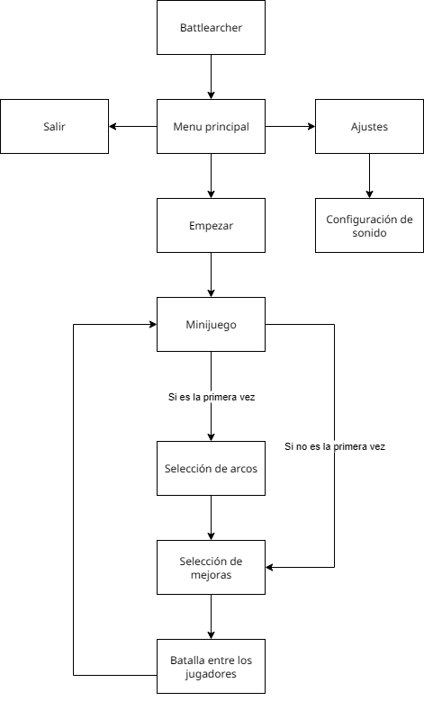

# ProyectoFinal-Fundamentos-Computacion

## Intrucciones para crear el ejecutable:

* Para generar la build en un directorio aparte usar el siguiente comando:
`cmake -B build && cmake --build build`

# Informe del proyecto 

Autores:
* Fernando Daniel Linder
* Mariano Fassi Koropecki

Docentes responsables:
* Alicia Rendón
* Matías Krujoski
* Briant Gauna
* Eduardo Díaz
* Brahian Bubans

## Introduccion
Battlearcher es un juego PvP (Player versus Player) ejecutado en local. Los jugadores cuentan con 3 árboles de habilidades, donde solamente pueden seleccionar uno. Posteriormente, se inicia el juego mostrando a ambos jugadores dentro de un mapa, donde se deberán de enfrentar. Cuando la vida de un jugador llegue a 0 se iniciará un minijuego de tiro a la diana donde se podrá conseguir puntos, estos puntos serán utilizados para desbloquear nuevas mejoras en relación al árbol que el jugador haya seleccionado en un principio.

## Idea inicial
Desde la etapa de planificación se propuso la creación de un videojuego, donde inicialmente pretendía ser un juego de rol por turnos, es decir, un juego de cartas. Luego, surgieron nuevas propuestas con el descubrimiento de una librería gráfica llamada “Raylib” y se comenzó a tener en cuenta la posibilidad de crear un juego con historia sobre un arquero que debía superar enemigos para liberar un reino. Sin embargo, con la posibilidad de tener varios jugadores en pantalla la idea tomó otra dirección, surgiendo así la idea de un enfrentamiento entre dos jugadores donde cada uno podría tener sus propias habilidades, haciendo así la experiencia de juego más entretenida y desafiante.

## Desarrollo
* Objetivos:
  * Se buscaba crear un juego 2D entretenido y corto, también comprender como se realiza la gestión de recursos y optimizaciones necesarias en sistemas con gráficos para que sea rápido y eficiente, utilizando las herramientas adquiridas durante el cursado de la materia.
* Diagrama de bloques:
  
* Informacion intercambiada entre modulos:
  * Las variables o recursos requeridos en distintas partes del sistema están declaradas globalmente. Se utilizó una estructura modular, reutilizable y mantenible, la cual consiste en modularizar la declaración de funciones y variables en un archivo “.h” para luego realizar la implementación en archivos “.c”. De esta forma se puede accede a variables de otros archivos y modificarlas simplemente importando él “.h” especifico. Sin embargo, principalmente las estructuras de los personajes, arcos y funciones de colisiones con el mapa y jugadores son las que se modifican constantemente.
* Funcionalidad de cada modulo:
  * Modulo de animacion: este se encarga de la animacion principal al iniciar el programa.
  * Modulo de configuracion: se utiliza para el control de sonido del juego.
  * Modulo de mapa: se utiliza para la generacion del mapa en el juego principal del programa.
  * Modulo de menu: se encarga de ordenar las opciones de seleccion para que el usuario pueda interactuar con el programa.
  * Modulos de jugador, proyectiles y arcos: estos son los modulos principales que se encargan del personaje, sus estadisticas y como interactua en el ambiente del juego.
* Estrategias de resolucion de cada componente:
Para la creacion del juego decidimos dividir el desarrollo en cuatro partes escenciales, lo cual nos ayudo a completarlo de forma mas amena.
  * Primero se decidio ir por la creacion de los menus para ir testeando la libreria y su funcionamiento.
  * Se crearon los personajes (modulo de jugador, proyectiles y arcos). Esto tuvo sus complicaciones al principio en cuanto al calculo de colisiones. Pero se pudo solucionar al usar unas funciones especificas en la libreria.
  * Despues se crearon los dos juegos. El mini juego para obtener puntos y el juego principal. Se crearon en ramas separadas y cada uno utilizo un tipo diferente de jugador, ya que las necesidades, entre juego y juego, eran distintas.
  * Por ultimo se crearon los arboles de habilidades en los cuales se podian gastar los puntos. Lo cual hizo muy facil la integracion con lo demas. Y se agregaron las texturas y la musica al juego.

* Herramientas y recursos utilizados:
  * Librería gráfica: Raylib
  * Lenguaje principal: C
  * Herramienta de construccion: CMake
  * Compilador: GCC (GNU Compiler Collection)
  * Imagenes y recursos visuales: Sora (Inteligencia artificial generativa multimodal)

## Conclusion
El proyecto en general nos sirvió para entender como crear un juego y tener un control estricto sobre optimización, modularidad y escalabilidad. Ya que durante el desarrollo, gracias a hacer las funciones modulares y escalables fue mucho más fácil y rápido el progreso en el proyecto, teniendo únicamente que agregar funciones o código muy especifico y sin tener que reformar los módulos.

